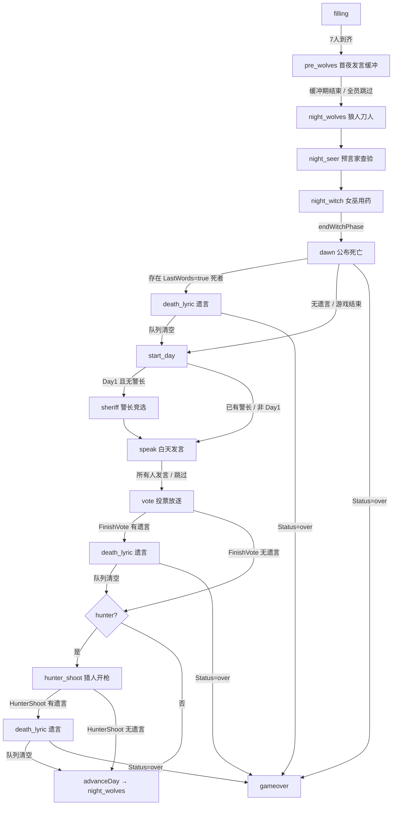

# 狼人杀 13 人标准竞技局 · 遗言 (Last Words) 功能设计

> 生效日期:2026-07-09
> 适用版本:LsmAgentGame ServerGo
> 上游文档:[`docs/狼人杀13人标准局规则.md`](狼人杀13人标准局规则.md) / [`docs/狼人杀-Agent与系统/狼人杀Agent设计.md`](狼人杀Agent设计.md) / [`docs/狼人杀房间聊天设计.md`](狼人杀房间聊天设计.md)

本文档为 13 人标准竞技局狼人杀新增 **遗言 (Last Words / Death-Lyric)** 阶段的设计,覆盖规则、产品、引擎、Agent 驱动、观战者交互、测试计划。

---

## §1 动机与范围

### 1.1 现状

`engine.go::killPlayer` 已经按死因 + `DayNumber` 计算 `Player.LastWords bool`:

| 死因 | LastWords | 条件 |
|---|---|---|
| `wolf` / `vote` / `hunter` | ✅ | `DayNumber <= LastWordsRounds (=2)` |
| `witch_poison` / `suicide` | ❌ | 永远无遗言 |

但引擎 **从未** 给 `LastWords=true` 的玩家安排一次真正的"公开发言"环节 — `PhaseDawn` 仅用于"公布死亡",随后 driver 调用 `start_day` 直接跳到 `sheriff/speak`。换言之,遗言目前只是一个从未被消费的标记。

### 1.2 目标

1. 给 `LastWords=true` 的出局玩家安排一次真正的 **遗言发言** 机会(≤ 100 字,全队可见)。
2. 遗言阶段内,其他已死亡玩家、存活玩家、观战者都可通过 `interject` / `whisper` 自由讨论。
3. 与既有 §104 (猎人死后开枪)、§112 (speak_floor)、§113 (phase clock)、§114 (spectator full-wake) 完全兼容。

### 1.3 不在范围内

- 不改 §5 胜负条件。
- 不改 §95 `pre_wolves` 强制发言。
- 不改 DB schema(遗言消息走既有 `chat.send` 广播路径)。
- 不改 WS 帧种类。
- 不改 `LastWordsRounds=2` 的既有数值。

---

## §2 规则层

### 2.1 触发条件

| 死因 | 遗言 | 备注 |
|---|---|---|
| 狼刀 (`wolf`) | ✅ if Day ≤ 2 | — |
| 白天放逐 (`vote`) | ✅ if Day ≤ 2 | — |
| 猎人开枪 (`hunter`) | ✅ if Day ≤ 2 | 猎人是"开枪者",被枪杀者出局;被枪杀者满足条件则有遗言 |
| 女巫毒杀 (`witch_poison`) | ❌ | — |
| 狼人自爆 (`suicide`) | ❌ | — |
| 游戏同时结束 | ❌ | `Status=="over"` 直接进 `PhaseGameOver` |

### 2.2 阶段槽

新增独立阶段 `PhaseDeathLyric` (字符串值 `"death_lyric"`),**不**复用 `PhaseDawn`。理由:

- `PhaseDawn` 语义 = "公布死亡",`PhaseDeathLyric` 语义 = "死者发言",两者关注点不同。
- 独立阶段让 `watchdogActingSeat` / `SkipPhaseAction` / `BuildTools` / `BuildUserPrompt` 各自干净分支,避免在 dawn 内部分叉。
- 独立阶段让前端 `PhaseClock` / `AgentThoughtPanel` 有独立渲染槽。

### 2.3 阶段顺序

#### 2.3.1 黎明路径(夜 → 白天)

```
night_wolves → night_seer → night_witch
    ↓ endWitchPhase
dawn (公布 LastNightDeaths)
    ↓ 若存在 LastWords=true 的死者
death_lyric (按座位升序,每位死者一次 last_words)
    ↓ 队列清空
start_day → sheriff/speak → vote → ...
```

- 多死(狼刀 + 女巫同夜毒杀):`LastNightDeaths` 中 `LastWords=true` 的座位入遗言队列(狼刀者入,毒杀者不入)。
- 队列按 **座位升序**(不是存活顺序 — 死者不在 `AliveSeats` 内,这是故意的)。

#### 2.3.2 白天放逐路径

```
vote → FinishVote → killPlayer(target,"vote")
    ↓ 若 target.LastWords=true 且 Status != "over"
death_lyric (仅 target 一座)
    ↓ 队列清空
    ↓ 若 target 角色 == hunter → hunter_shoot
    ↓ 否则 advanceDay → night_wolves
```

#### 2.3.3 猎人开枪路径

```
hunter_shoot → HunterShoot(target) → killPlayer(target,"hunter")
    ↓ 若 target.LastWords=true 且 Status != "over"
death_lyric (仅 target 一座)
    ↓ 队列清空
advanceDay → night_wolves
```

> 注意:猎人开枪者是"活着的猎人"(死后能力,§104),开枪者自己不会在同一事件出局,所以**开枪者不入遗言队列**。

#### 2.3.4 猎人死于狼刀 / 放逐(§104 联动)

```
[夜] wolf_kill hunter → dawn → death_lyric(猎人遗言) → hunter_shoot(猎人开枪) → advanceDay
[vote] vote hunter   → death_lyric(猎人遗言) → hunter_shoot(猎人开枪) → advanceDay
```

即:猎人出局事件后,顺序为 **公布 → 遗言 → 开枪 → 下一夜**。

### 2.4 遗言行为

- 当前遗言座位(=`DeathLyricCurrent`)调用 `last_words(text ≤ 100)` 提交;或 `last_words_skip` 放弃。
- 遗言内容走既有 `chat.send` 广播路径,前端标记 💀 遗言。
- 遗言后 `Players[seat].LastWords = false`(已消费,不会二次入队)。
- 非遗言座位(存活 / 已死亡非当前 / 观战者)可 `interject` / `whisper` 自由讨论。

### 2.5 阶段出口

- 队列清空 → 调用 `onDone` 闭包,恢复原路径:
  - 黎明路径 → `StartDay`(进 sheriff/speak)。
  - 放逐路径 → 若死者是 hunter 且 `HunterPendingShoot` → `PhaseHunterShoot`;否则 `advanceDay`。
  - 猎人开枪路径 → `advanceDay`。

---

## §3 完整阶段流 (mermaid)



---

## §4 产品层 (UI / 视图)

### 4.1 阶段标识

| 字段 | 值 |
|---|---|
| `game.state.phase` | `"death_lyric"` |
| 阶段中文标签 | `💀 遗言阶段` |
| 活动事件 | `death_lyric_start` / `death_lyric_spoken` / `death_lyric_skipped` |

### 4.2 `phase_extra` 新增字段

```json
"death_lyric": {
  "current_seat": 4,
  "total": 1,
  "done": 0
}
```

### 4.3 `phase_extra.dead_list` (全玩家 + 观战者可见)

```json
"dead_list": [
  { "seat": 2, "account": "Bot 3号", "role": "werewolf", "last_words": "spoken",   "cause": "wolf",  "day": 1 },
  { "seat": 4, "account": "Bot 5号", "role": "hunter",  "last_words": "pending",  "cause": "vote",  "day": 2 },
  { "seat": 5, "account": "Bot 6号", "role": "witch",   "last_words": "ineligible", "cause": "witch_poison", "day": 1 }
]
```

`last_words` 枚举:`"spoken"` / `"skipped"` / `"pending"` / `"ineligible"`。

### 4.4 前端渲染

- `AgentThoughtPanel` 遗言行前缀 `💀 遗言`,颜色区别于普通发言(普通发言蓝色,遗言橙色)。
- `PhaseClock` 倒计时沿用 §113 `phase_deadline_at`,每个遗言座位独立计时(默认 30s)。
- 非遗言座位玩家 / 观战者发送的 `chat.send` 在遗言阶段正常渲染,发言者名称旁加 `💀 已死亡` 标识(若发言者已死)。

### 4.5 活动事件文案

| 事件 | 文案 | 图标 |
|---|---|---|
| `death_lyric_start` | `💀 X 号开始遗言` | 💀 |
| `death_lyric_spoken` | `💀 X 号完成遗言` | 💀 |
| `death_lyric_skipped` | `💀 X 号放弃遗言` | 💀 |

---

## §5 Engine 代码设计

### 5.1 新增阶段常量

`engine.go` Phase 常量块新增:

```go
PhaseDeathLyric               // 遗言:LastWords=true 的死者公开发言
```

字符串值 `"death_lyric"`(与 `Phase.String()` 一致)。

### 5.2 `GameState` 新增字段

```go
// 遗言阶段状态
DeathLyricQueue   []Seat          // 当前遗言轮等待队列(座位升序)
DeathLyricDone    map[Seat]bool   // 已发言 / 已跳过的座位
DeathLyricCurrent Seat            // 当前应遗言座位;NoSeat = 无
DeathLyricOnDone  func() *errcode.Error // 队列清空后恢复路径的闭包(仅遗言阶段内非 nil)
```

> 闭包方案优于"resume enum":避免在 `GameState` 引入额外状态机;调用方(`endWitchPhase` / `FinishVote` / `HunterShoot`)各自传入自己的恢复逻辑。

### 5.3 引擎方法(全部 lock-held 约定,§92a)

```go
// filterLastWords 从 seats 中筛出 LastWords=true 的座位,按升序返回。
func filterLastWords(gs *GameState, seats []Seat) []Seat {
    out := make([]Seat, 0, len(seats))
    for _, s := range seats {
        if s >= 0 && s < MaxPlayers && gs.Players[s].LastWords {
            out = append(out, s)
        }
    }
    sort.Slice(out, func(i, j int) bool { return out[i] < out[j] })
    return out
}

// StartDeathLyricRound 进入遗言阶段。
//  - seats:候选座位(函数内部 filterLastWords,空则返回 ErrDeathLyricSkip 哨兵)。
//  - onDone:队列清空后调用的恢复闭包。
// 前置:Phase ∈ {PhaseDawn, PhaseVote, PhaseHunterShoot} 之一,Status != "over"。
func (gs *GameState) StartDeathLyricRound(seats []Seat, onDone func() *errcode.Error) *errcode.Error {
    if gs.Status == "over" {
        return errcode.CodeMsg(errcode.ErrValidationFailed, "game over")
    }
    lw := filterLastWords(gs, seats)
    if len(lw) == 0 {
        return ErrDeathLyricSkip // 哨兵:调用方应直接调 onDone
    }
    gs.Phase = PhaseDeathLyric
    gs.DeathLyricQueue = lw
    gs.DeathLyricDone = make(map[Seat]bool)
    gs.DeathLyricCurrent = lw[0]
    gs.DeathLyricOnDone = onDone
    return nil
}

// ErrDeathLyricSkip 是 StartDeathLyricRound 的"无遗言可发"哨兵。
var ErrDeathLyricSkip = errcode.CodeMsg(errcode.ErrValidationFailed, "no last words to say")

// SayLastWords 当前遗言座位提交遗言。
func (gs *GameState) SayLastWords(seat Seat, text string) *errcode.Error {
    if gs.Phase != PhaseDeathLyric {
        return errcode.CodeMsg(errcode.ErrNotYourTurn, "not death_lyric phase")
    }
    if gs.DeathLyricCurrent != seat {
        return errcode.CodeMsg(errcode.ErrNotYourTurn, "not your last-words turn")
    }
    gs.Players[seat].LastWords = false // 已消费
    gs.DeathLyricDone[seat] = true
    return gs.popDeathLyricQueue()
}

// SkipLastWords 当前遗言座位放弃遗言。
func (gs *GameState) SkipLastWords(seat Seat) *errcode.Error {
    if gs.Phase != PhaseDeathLyric {
        return errcode.CodeMsg(errcode.ErrNotYourTurn, "not death_lyric phase")
    }
    if gs.DeathLyricCurrent != seat {
        return errcode.CodeMsg(errcode.ErrNotYourTurn, "not your last-words turn")
    }
    gs.Players[seat].LastWords = false
    gs.DeathLyricDone[seat] = true
    return gs.popDeathLyricQueue()
}

// popDeathLyricQueue 推进队列;队列空则调 EndDeathLyricRound。
func (gs *GameState) popDeathLyricQueue() *errcode.Error {
    gs.DeathLyricQueue = gs.DeathLyricQueue[1:]
    if len(gs.DeathLyricQueue) == 0 {
        return gs.EndDeathLyricRound()
    }
    gs.DeathLyricCurrent = gs.DeathLyricQueue[0]
    return nil
}

// EndDeathLyricRound 清空遗言状态并调用 onDone 恢复路径。
func (gs *GameState) EndDeathLyricRound() *errcode.Error {
    gs.DeathLyricQueue = nil
    gs.DeathLyricCurrent = NoSeat
    gs.DeathLyricDone = nil
    onDone := gs.DeathLyricOnDone
    gs.DeathLyricOnDone = nil
    if onDone != nil {
        return onDone()
    }
    return nil
}
```

### 5.4 哨兵识别

调用方判断是否进入遗言阶段:

```go
if err := gs.StartDeathLyricRound(seats, onDone); err != nil {
    if err == ErrDeathLyricSkip {
        // 无遗言可发,直接调 onDone 恢复
        return onDone()
    }
    return err
}
```

---

## §6 对现有流程的改动 (delta)

### 6.1 `endWitchPhase` (engine.go:585)

```go
func (gs *GameState) endWitchPhase() {
    if gs.WolfKillTarget != NoSeat {
        if err := gs.killPlayer(gs.WolfKillTarget, "wolf"); err == nil {
            gs.NightDeaths = appendUniqueSeat(gs.NightDeaths, gs.WolfKillTarget)
        }
    }
    gs.Phase = PhaseDawn
    gs.TurnActingSeat = NoSeat
    gs.LastNightDeaths = append([]Seat{}, gs.NightDeaths...)
    gs.checkWinner()
    if gs.Status == "over" {
        return
    }
    // 遗言:LastNightDeaths 中 LastWords=true 的座位入队
    gs.tryEnterDeathLyricRound(gs.LastNightDeaths, func() *errcode.Error {
        return gs.StartDay()
    })
}
```

`tryEnterDeathLyricRound` 是 §5.4 的哨兵识别包装。

### 6.2 `StartDay` (engine.go:628)

**不改**。它现在是黎明遗言路径的 `onDone` 闭包。

### 6.3 `FinishVote` (engine.go:780)

在 `killPlayer(target,"vote")` + `checkWinner()` 之后:

```go
if gs.Status == "over" {
    return nil
}
// 遗言:target.LastWords=true 则进入遗言阶段
gs.tryEnterDeathLyricRound([]Seat{target}, func() *errcode.Error {
    // 恢复路径:猎人开枪 or 进下一夜
    if gs.Roles[target] == RoleHunter {
        gs.HunterPendingShoot = true
        gs.HunterPendingFrom = "vote"
        gs.Phase = PhaseHunterShoot
        return nil
    }
    gs.advanceDay()
    return nil
})
return nil
```

> 注意:原 `FinishVote` 在 hunter 分支直接设 `Phase=PhaseHunterShoot` 并 return;现在改为"先遗言,后开枪"。

### 6.4 `HunterShoot` (engine.go:863)

在 `killPlayer(target,"hunter")` + `checkWinner()` 之后:

```go
gs.HunterPendingShoot = false
gs.HunterPendingFrom = ""
if gs.Status == "over" {
    return nil
}
gs.tryEnterDeathLyricRound([]Seat{target}, func() *errcode.Error {
    return gs.advanceDay()
})
return nil
```

### 6.5 `advanceDay` (engine.go:836)

**不改**。

### 6.6 `WolfSuicide` (engine.go:863 附近)

`Players[actor].LastWords = false` 已设置,`killPlayer(actor,"suicide")` 也返回 `LastWords=false`。自杀不会触发遗言 — 无需改动。

### 6.7 `watchdogActingSeat` (room.go:1896)

```go
case PhaseDeathLyric:
    if gs.DeathLyricCurrent >= 0 {
        return int(gs.DeathLyricCurrent)
    }
    return lowestAliveBotSeatLocked(r)
```

### 6.8 `buildAgentContextLocked` (room.go:1525)

```go
case PhaseDeathLyric:
    gc.MyTurn = (seat == gs.DeathLyricCurrent)
    gc.DeathLyricCurrent = int(gs.DeathLyricCurrent)
```

> §86 教训:acting-bot 判定必须用权威字段 `gc.MyTurn`。

### 6.9 `speak_floor.go` (§112)

遗言座位调用 `last_words` 视为一次"公开发言",计入 `speak_count_last_min`,避免 floor watchdog 在遗言阶段误 wake。实现:`activity_emitter` 在 `death_lyric_spoken` / `death_lyric_skipped` 事件上调用 `b.noteIfSpeaking()`(与 `speak` / `interject` 同)。

### 6.10 `activity_emitter.go`

新增事件种类:

```go
ActivityEventKindDeathLyricStart  = "death_lyric_start"
ActivityEventKindDeathLyricSpoken = "death_lyric_spoken"
ActivityEventKindDeathLyricSkipped = "death_lyric_skipped"
```

新增 `EmitDeathLyricStart(r, seat)` / `EmitDeathLyricSpoken(r, seat, text)` / `EmitDeathLyricSkipped(r, seat)` 方法,文案见 §4.5。

### 6.11 `view.go`

- `phase_extra` 新增 `death_lyric` 块。
- `phase_extra` 新增 `dead_list` 数组(遍历 `Players`,按 `Alive=false` 收集,附带 `last_words` 状态)。
- `BotTranscripts[seat]` 在遗言阶段追加一行 `💀 遗言:...` / `💀 放弃遗言`。

### 6.12 `room.go` 工具派发

`room_dispatch.go` / `room.go` 的 `Action_*` 派发新增:

```go
case "last_words":
    return m.sayLastWordsLocked(r, userID, text)
case "last_words_skip":
    return m.skipLastWordsLocked(r, userID)
```

`sayLastWordsLocked` / `skipLastWordsLocked` 是 lock-held 变体(§92a),内部调 `gs.SayLastWords` / `gs.SkipLastWords`,成功后:

- 广播 `chat.send`(遗言内容 / 放弃提示)。
- 触发 `EmitDeathLyricSpoken` / `EmitDeathLyricSkipped`。
- 若队列清空 → `EndDeathLyricRound` 已自动调 `onDone`。

### 6.13 `room_quarantine_skip_locked.go`

`dispatchQuarantinedSkipLocked` 新增分支:

```go
case "death_lyric":
    return m.skipLastWordsLocked(r, actingSeat)
```

`SkipPhaseAction` 新增行(详见 §7)。

### 6.14 `spectatorWakeAllowedPhases` (room.go:193 附近)

白名单新增 `PhaseDeathLyric`,让观战者在遗言阶段公开发言能 wake 存活 bot(§114 联动)。

### 6.15 `config.config.go`

`WerewolfConfig` 新增:

```go
DeathLyricEnabled      bool `json:"death_lyric_enabled"`      // 默认 true
DeathLyricDeadlineSec  int  `json:"death_lyric_deadline_sec"` // 默认 30
```

`DeathLyricEnabled=false` 回退到旧行为(dawn 直接 → start_day)。

---

## §7 Agent 驱动 (agent/*)

### 7.1 `agent/tools.go`

新增 case:

```go
case "PhaseDeathLyric", "death_lyric":
    // 仅当前遗言座位可发遗言
    if gc.DeathLyricCurrent == seat {
        add("last_words", "遗言。这是你在出局前的最后一次公开发言,全队可见。≤ 100 字。",
            schema(map[string]any{"text": map[string]any{"type": "string", "description": "遗言内容,≤100字"}}, "text"))
        add("last_words_skip", "放弃遗言。你将跳过本次公开发言机会。", schema(map[string]any{}))
    }
    // 其他座位(存活 / 已死非当前 / 观战者)可自由讨论
    add("interject", /* 同 speak 段 */)
    add("whisper",  /* 同 speak 段 */)
```

> `BuildTools` 签名不变;`gc.DeathLyricCurrent` 由 manager 在 `buildAgentContextLocked` 填充。

### 7.2 `agent/run.go` SkipPhaseAction

新增行:

```go
case "death_lyric", "PhaseDeathLyric":
    // 遗言座位放弃遗言,推进队列。
    return "last_words_skip", 0
```

### 7.3 `agent/prompt.go`

阶段标签:

```go
case "PhaseDeathLyric", "death_lyric":
    return "💀 遗言阶段"
```

`BuildUserPrompt` 追加:

- `gc.MyTurn && gc.Phase=="death_lyric"`:
  ```
  【遗言】这是你在出局前的最后一次公开发言,全队可见。请用 ≤ 100 字留下最后的陈述,或调用 last_words_skip 放弃。
  ```
- `!gc.MyTurn && gc.Phase=="death_lyric"`:
  ```
  当前 X 号正在发表遗言。你可以用插话(interject)/私聊(whisper)自由讨论。
  ```

### 7.4 `agent/run.go` 事件循环

无需改动 — `gc.MyTurn` 由 manager 计算,run loop 按 `MyTurn` 决定是否发起 LLM。遗言阶段 LLM 调用走既有 `speak` 同路径,限流沿用 `SpeakLimiter`(45s)。

---

## §8 观战者与聊天 (§13 / §114 联动)

### 8.1 观战者 wake 白名单

`PhaseDeathLyric` 加入 `spectatorWakeAllowedPhases` — 观战者公开发言会 wake 存活 bot(但不会 wake 已死亡的遗言 actor,因为 actor 已有 `MyTurn`)。

### 8.2 已死亡玩家聊天

- 已死亡非当前座位调用 `interject` / `whisper` 走既有 `chat.send` 路径。
- 前端渲染时,若 `from_user_id` 对应 `Players[seat].Alive=false`,发言者名称旁加 `💀 已死亡` 标识。
- 遗言 actor 的 `last_words` 内容也走 `chat.send`,前端标记 `💀 遗言`。

### 8.3 私聊

遗言阶段 `whisper` 可用(遗言 actor 也可私聊),走既有 90s whisper 限流。

---

## §9 边界与回退

### 9.1 边界

| 场景 | 行为 |
|---|---|
| Day ≥ 3 出局 | `LastWords=false`,不入队 |
| 出局同时游戏结束 | 直接 `PhaseGameOver`,无遗言 |
| 多死(狼刀 + 毒杀) | 仅 `LastWords=true` 者入队 |
| 遗言 actor 被 quarantine | watchdog 90s 派 `last_words_skip` |
| 遗言 actor 是 hunter | 遗言 → hunter_shoot(§104 联动) |
| 所有死者都被 quarantine | watchdog 逐个派 `last_words_skip`,队列清空 |
| `DeathLyricEnabled=false` | 回退到旧行为 |

### 9.2 回退

`LsmAgentGame.conf`:

```json
"werewolf": {
  "death_lyric_enabled": true,
  "death_lyric_deadline_sec": 30
}
```

`death_lyric_enabled=false` 时,`tryEnterDeathLyricRound` 不调 `StartDeathLyricRound`,直接调 `onDone`。

---

## §10 测试计划

### 10.1 engine_test.go

| 测试 | 验证点 |
|---|---|
| `TestDeathLyric_DawnMultiFilter` | `LastNightDeaths=[2(wolf,Day1,LastWords=true),4(poison,LastWords=false)]` → `StartDeathLyricRound` → `DeathLyricQueue=[2]` |
| `TestDeathLyric_Day3NoLastWords` | Day=3 killPlayer wolf → `LastWords=false` → `StartDeathLyricRound` 返回 `ErrDeathLyricSkip` |
| `TestDeathLyric_HunterOrder` | Day=2 vote hunter → 遗言 → hunter_shoot → advanceDay(DayNumber 递增,Phase 回 night_wolves) |
| `TestDeathLyric_SayAndSkip` | 队列 [2,4];seat=2 SayLastWords → Current=4;seat=4 SkipLastWords → 队列空 → onDone 被调 |
| `TestDeathLyric_GameOverNoLyric` | killPlayer 触发 `Status=over` → 不进遗言 |

### 10.2 room_full_ai_test.go

- 7 AI 完整对局,Day=2 投票放逐 → 观察 `death_lyric` 阶段出现在活动流中。

### 10.3 Watchdog 测试

- 遗言 actor 被 quarantine → 90s 后 watchdog 派 `last_words_skip` → 队列清空 → 游戏继续。

---

## §11 风险与缓解

| 风险 | 缓解 |
|---|---|
| 新阶段引入遗漏分支导致死锁 | watchdog 90s 兜底 + `dispatchQuarantinedSkipLocked` 新增 `death_lyric` 分支 |
| 遗言 actor 是 hunter 时,顺序错误导致 §104 复发 | 严格顺序:遗言 → hunter_shoot;单元测试 `TestDeathLyric_HunterOrder` 锁定 |
| 多死时队列顺序不一致 | `filterLastWords` 强制座位升序 |
| 遗言阶段观战者消息暴增 | §114 spectator full-wake + `LLMCallLimiter=8s` 兜底 |
| 配置错误导致 deadline 早于 watchdog tick | §113 教训:deadline 优先于 90s 兜底 |

---

## §12 给 backend-dev 的实现顺序建议

1. **engine.go**:新增 `PhaseDeathLyric` 常量 + `GameState` 4 个字段 + `filterLastWords` / `StartDeathLyricRound` / `SayLastWords` / `SkipLastWords` / `popDeathLyricQueue` / `EndDeathLyricRound` + `ErrDeathLyricSkip` 哨兵。
2. **engine.go**:改 `endWitchPhase` / `FinishVote` / `HunterShoot` 三个出口,插入 `tryEnterDeathLyricRound` 调用。
3. **engine_test.go**:5 个单元测试(§10.1)。
4. **activity_emitter.go**:3 个新事件种类 + 3 个 Emit 方法。
5. **view.go**:`phase_extra.death_lyric` + `phase_extra.dead_list` + `BotTranscript` 遗言行。
6. **room.go**:`watchdogActingSeat` / `buildAgentContextLocked` / `spectatorWakeAllowedPhases` 新增 `PhaseDeathLyric` 分支;`phase_deadline_at` 在遗言阶段设置。
7. **room_quarantine_skip_locked.go**:`sayLastWordsLocked` / `skipLastWordsLocked` lock-held 变体 + `dispatchQuarantinedSkipLocked` 新增 `death_lyric` 分支。
8. **agent/tools.go**:`PhaseDeathLyric` case。
9. **agent/run.go**:`SkipPhaseAction` 新增 `death_lyric` 行。
10. **agent/prompt.go**:阶段标签 + 遗言 prompt 块。
11. **speak_floor.go**:遗言计入 `speak_count_last_min`。
12. **config.config.go**:`DeathLyricEnabled` / `DeathLyricDeadlineSec`。
13. **docs/狼人杀13人标准局规则.md**:§2 阶段流 + §11 工具集 + §13.4 白名单 + §15 联动。
14. **docs/狼人杀-Agent与系统/狼人杀Agent设计.md**:新增遗言段落。
15. **docs/狼人杀房间聊天设计.md**:新增遗言聊天段落。
16. **go build ./... && go test ./ServerGo/game/werewolf/...** 编译 + 测试。
17. **./rebuild_restart_app.sh** 重启验证。
18. **git commit** 中文提交。

---

> **变更记录**
> - 2026-07-09:初版,新增遗言 (Last Words) 功能设计。
