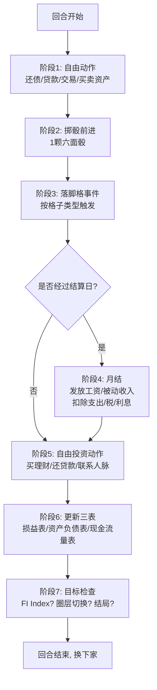

# 虚拟城市 · 总体设计

> 本文档是 LsmAgentGame 平台「虚拟城市」模块的总纲设计文件，定义游戏定位、核心理念、整体架构、特色机制与教育目标。
> 具体规则数值见《虚拟城市规则与经济系统》（下称《规则与经济系统》）；棋盘格子、卡牌、道具的物理设计见《虚拟城市棋盘与道具设计》（下称《棋盘与道具设计》）；
> **游戏所有数值与机制背后的真实世界事实依据、理论出处与参数校准表**见《虚拟城市真实世界经济与财商理论底座》（下称《真实世界底座》）。
>
> **版本**：v1.4 原创设计稿
> **计价货币**：人民币（元）
> **设计日期**：2026-09-10
> **v1.1 修订（2026-09-10）**：新增《真实世界底座》作为本模块第四份文档；第 8.3 节市场周期参数按中国 LPR/CPI 真实区间校准。
> **v1.2 修订（2026-09-10）**：§2 差异化对比表补充 Brass 贷款降收入等级、FCM 行业里程碑、Chair the Fed 宏观模拟等新调研参考维度；§8 特色机制总览补充各机制借鉴来源标注；附录交叉引用索引补全至全部 5 份设计文件与 10 份参考资料。
> **v1.3 修订（2026-09-10）**：附录交叉引用索引补入《玩家职业设计》v1.0（12 位玩家完整画像）；至此「虚拟城市」模块共 **8 份设计文件 + 16 份类似游戏资料**，形成"总纲+5 份专项+1 份玩家画像+1 份底座+16 份调研"的完整文档体系。
> **v1.4 修订（2026-09-10）**：附录交叉引用索引同步《玩家职业设计》v1.1 扩展至 18 位玩家（核心 12 + 扩展 6）；调研资料 16→19 份（新增《股票市场与房地产创业类桌游补遗资料》覆盖 Stockpile / High Society / Lords of Vegas / 18xx 家族 / 创业融资素材）；《底座》新增板块 11「2024–2026 中国市场最新数据快照」（LPR 月度序列 / 存款利率"1 字头" / 黄金 $4,490 / 个人养老金全面推开等）。至此 8 + 19 份文档覆盖 ~21,200 行 Markdown。

---

## 目录

1. [游戏定位与目标用户](#1-游戏定位与目标用户)
2. [与四款参考游戏的差异化对比](#2-与四款参考游戏的差异化对比)
3. [核心理念与财富观](#3-核心理念与财富观)
4. [核心循环（Core Loop）](#4-核心循环core-loop)
5. [游戏整体架构](#5-游戏整体架构)
6. [三层棋盘宏观结构与人生阶段](#6-三层棋盘宏观结构与人生阶段)
7. [胜利条件、失败条件与多结局](#7-胜利条件失败条件与多结局)
8. [特色机制总览](#8-特色机制总览)
9. [教育目标与财商知识点矩阵](#9-教育目标与财商知识点矩阵)
10. [Agent 驱动的线上化特色](#10-agent-驱动的线上化特色)

---

## 1. 游戏定位与目标用户

### 1.1 一句话定位

**「虚拟城市」是一款以中国真实经济环境为底座、以三层人生棋盘为骨架、以五维资源与三表联动为核心机制的 Agent 驱动多人财商桌游。** 玩家在 2 小时内走完 20–60 岁的职业生涯，通过股票、房产、创业、副业等 8 类投资品构建被动收入，在市场周期与人生事件的双重冲击下理解现金流、杠杆、风险与自由的关系。

### 1.2 目标用户分层

| 用户层 | 画像 | 核心需求 | 适配模式 |
|--------|------|----------|----------|
| **入门玩家（18–25 岁）** | 大学生、职场新人 | 建立财商直觉，理解工资/支出/资产的关系 | 线下 6 人桌 + Agent 教练带盘 |
| **进阶玩家（26–40 岁）** | 城市白领、新婚家庭 | 验证自己的资产配置思路，测试杠杆与市场周期决策 | 线上 Agent 对局，3–6 人 |
| **高净值玩家（40+）** | 企业主、投资者 | 多资产配置、财富传承、税务筹划的沙盘推演 | 线上 Agent 对局 + 自由圈深度规则 |
| **教育场景** | 学校财商课、企业团建、银行/保险获客活动 | 标准化规则讲解 + 结构化复盘 | 线下 + Agent 教练主持 |

### 1.3 核心卖点

1. **真实中国经济底座**：人民币计价、中国职业、中国税务社保、A 股/房贷/REITs/一线城市房价区间等真实参数，不是美元游戏的简单换算。
2. **三表联动财务系统**：损益表 + 资产负债表 + 现金流量表三表勾稽，比富爸爸两表更贴近真实会计，玩家被迫同时看三张表。
3. **五维资源可量化**：金钱/时间/精力/人脉/认知五类资源全部有数值、有获取途径、有消耗场景、可交易，不是模糊的"心态元素"。
4. **市场周期系统**：复苏/繁荣/衰退/萧条四阶段循环，利率与通胀联动，资产价格随周期波动，训练逆周期思维。
5. **Agent 原生设计**：银行家、教练、NPC 雇主、投资人、交易对手均可由 AI Agent 担任，支持 1 人也能玩（单人模式）。
6. **多维度结局**：不是简单"先到终点者赢"，而是财务自由/人生圆满/平庸度日/破产出局等多结局，鼓励反思而非竞争。

---

## 2. 与四款参考游戏的差异化对比

> 本节对比对象：①富爸爸现金流 CASHFLOW 101；②财富流沙盘（富而喜悦）；③时空流沙盘/中文现金流改编；④大富翁 Monopoly 及 Power Grid/Catan/Acquire 等经典经济桌游。

| 对比维度 | 富爸爸现金流 | 财富流沙盘 | 大富翁/经济桌游 | **虚拟城市（本作）** |
|----------|-------------|-----------|----------------|----------------------|
| **棋盘层级** | 两层（老鼠赛跑+快车道） | 三层（逆流/平流/顺流，中央迷宫） | 单环 40 格 | **三层发展圈（生存→积累→自由），单向上升+可跌落** |
| **财务报表** | 两表（损益+资产负债） | 两表（损益+资产负债） | 无报表 | **三表联动（损益+资产负债+现金流量表）** |
| **资源维度** | 仅金钱 | 五元素（时间/精力/人脉/能力/金钱，定性为主） | 金钱+地产 | **五维资源全部量化：金钱/时间/精力/人脉/认知，各有上限与恢复机制** |
| **货币与语境** | 美元，美式职业 | 人民币，中国职业 | 美元/新台币 | **人民币，12 个中国化职业（外卖骑手/程序员/公务员等）** |
| **税务系统** | 固定税额，无累进 | 固定税额 | 所得税格固定额 | **个税累进税率表（7 级）+ 资本利得税 + 企业税简化** |
| **市场周期** | 市场风云卡随机事件 | 行情卡随机事件 | 无宏观周期 | **四阶段宏观周期系统，利率/通胀/就业联动，持续 2–4 年** |
| **投资品类** | 股票/房产/企业/贵金属 4 类 | 金融/副业/房产/企业 4 类 | 仅地产 | **8 类：股票基金/房产/企业/副业/债券理财/贵金属/保险/养老金** |
| **时间机制** | 无年龄，按回合推进 | 20–60 岁，5 年一钟声 | 无年龄概念 | **20–60 岁，1 回合=1 月，5 年一钟声，含退休/养老阶段** |
| **社交/交易** | 禁止玩家间合伙（101 版） | 鼓励合作与交易 | 自由议价地产 | **开放交易：房产/股票/企业/机会卡/借贷/合伙，Agent 也参与交易** |
| **AI/Agent 支持** | 无（需银行家） | 无（需教练带盘） | 无 | **原生 Agent 架构：银行家/教练/NPC 雇主/投资人均可 AI 担任** |
| **胜利判定** | 买梦想或现金流+5万 | 出圈+梦想家/慈善家/创富家 | 最后未破产者 | **多维度结局：财务自由指数+人生满意度+净资产综合评分** |
| **教育深度** | 会计入门+资产负债观 | 财商+情商+逆商+觉察 | 垄断思维 | **会计+宏观周期+资产配置+税务+风险管理，对应 20+ 财商知识点** |
| **贷款与信用评级** | 无贷款等级概念 | 无 | 大富翁有房贷但无信用分级 | **银行贷款→信用评分→违约扣押梯度（借鉴 Brass: Birmingham £10/20/30 贷款降 1/2/3 收入等级机制 + Container 贷款利息与违约扣押）** |
| **行业里程碑/先发优势** | 无 | 无 | 无 | **企业经营里程碑卡：首个进入某行业的玩家获得先发优势奖励（借鉴 Food Chain Magnate 8 张里程碑卡系统）** |
| **宏观政策模拟** | 无（纯随机事件） | 无（随机事件） | 无 | **市场周期骰 + 政策卡模拟利率/通胀/就业联动（借鉴 Chair the Fed 单人宏观模拟游戏的利率-通胀反馈环）** |
| **行为金融心魔** | 无（仅文字说教） | 觉察卡但无量化机制 | 无 | **30 张心魔卡 + 系统级偏差触发，量化心理偏差的财务代价（学术来源：Kahneman & Tversky 1979 等）** |

**差异化结论**：本作不做任何一款参考游戏的换皮，而是——
- 从富爸爸继承"被动收入>总支出"的核心公式与两表结构，**升级为三表联动**；
- 从财富流继承三层结构与五元素，**将五元素全部量化为可操作数值**，并把"逆流迷宫"改为"生存圈"（更写实的底层，而非心理隐喻）；
- 从大富翁继承格子事件与地租逻辑，**用市场周期替代纯随机抽卡**；
- 从 Power Grid 继承"阶段切换改变经济结构"与"反向阶段追赶"，**用圈层切换与市场周期阶段实现**；
- 从 Catan 继承"玩家间自由议价市场"，**全面开放玩家间交易与合伙**；
- 从 Acquire 继承"事件驱动大额现金流（并购/IPO）"与三档股价定价梯度，**在自由圈加入企业并购与资本运作卡牌**；
- 从 Brass: Birmingham/Lancashire 借鉴**贷款降收入等级机制**（£10/20/30 贷款对应降 1/2/3 收入等级），在债务系统中设计信用评分与违约扣押梯度；
- 从 Food Chain Magnate 借鉴**行业里程碑卡系统**（首个营销汉堡/披萨/饮料各+$5/份），在企业经营中补充先发优势机制；
- 从 Chair the Fed 借鉴**利率-通胀反馈环**宏观模拟，强化市场周期系统的教育深度；
- 从 1830 借鉴**股票轮/运营轮分离**与公司资金池设计，深化企业股权与资本市场模拟。

---

## 3. 核心理念与财富观

### 3.1 原创财富观陈述

> **"财富不是数字的堆叠，而是当你停止出售时间时，仍能维持生活质量的能力。"**

本作的财富观由以下五条原创命题构成（不照搬清崎"富人不为钱工作"，也不照搬九哥"富而喜悦"）：

1. **现金流优先于净资产**。账面资产再高，若每月现金流出大于流入，仍是穷人。三表联动强制玩家看现金流量表，而不是只看资产负债表上的数字。
2. **收入结构比收入总额重要**。月薪 3 万但全是主动收入、月支出 2.5 万的人，财务自由度远低于月薪 8 千但已建立 5 千被动收入的人。游戏通过"自由圈进入条件 = 被动收入 > 总支出"强制教授这一点。
3. **风险不是坏事，不量化风险才是坏事**。保险、分散投资、认知提升都是降低风险的工具，但零风险意味着零超额收益。游戏通过市场周期波动与事件系统，让玩家体会"风险与收益对称"。
4. **时间是最稀缺的不可再生资源**。20–60 岁只有 40 年，每 5 年钟声一响就少 5 年。精力与认知的成长需要时间窗口，错过了就无法重来。游戏用时间轴与精力系统双重强化这一点。
5. **财富与人生不是零和博弈**。本作不采用"最后一人胜利"的大富翁式垄断逻辑，而是多维度结局：财务自由但孤独终老、平庸度日但家庭和睦、破产出局但经历丰富——每种结局都有教育价值，由玩家在复盘中反思。

### 3.2 核心公式（全游戏灵魂）

```
财务自由指数（FI Index）= 月被动收入 ÷ 月总支出

- FI Index < 0.5：生存状态，完全依赖工资
- 0.5 ≤ FI Index < 1：积累状态，正在向自由过渡
- FI Index ≥ 1：财务自由，被动收入覆盖支出
- FI Index ≥ 1.5：人生宽松，可进行大额消费与传承
```

对应真实世界概念：**FIRE（Financial Independence, Retire Early）运动的核心指标**。

---

## 4. 核心循环（Core Loop）

### 4.1 单回合核心循环



### 4.2 全局时间循环


对应真实世界概念：**人生生命周期理论（生命周期假说）**——青年积累、中年奋斗、老年消耗。

---

## 5. 游戏整体架构

### 5.1 基本参数

| 参数 | 数值 | 说明 |
|------|------|------|
| 人数 | 3–6 名人类玩家 + 1 名 Agent 银行家 | 支持 1 人单人模式（其余 5 个位置由 Agent 填充） |
| 单局时长 | 120–150 分钟（含 20 分钟复盘） | 新手局约 180 分钟 |
| 年龄建议 | 14 岁以上 | 14–17 岁需成人陪同；青少年版可简化税务与杠杆规则 |
| 游戏内时间 | 20 岁 → 60 岁，共 40 年 | 1 回合 = 1 个游戏月；约 480 个游戏月 |
| 实际时间比 | 1 分钟 ≈ 3 个游戏月 | 120 分钟 × 3 = 360 月 ≈ 30 年，加上钟声推进补足 40 年 |
| 棋盘层数 | 3 层（生存圈/积累圈/自由圈） | 详见第 6 章 |
| 职业卡数量 | 12 张 | 详见《规则与经济系统》第 10 章 |
| 卡牌总数 | **315 张**（原 270 + 心魔卡 30 + 行业/资本运作/失信卡 15） | 基础牌池见《棋盘与道具设计》第 6 章；心魔卡见《行为金融与投资心理机制设计》附录 B；行业卡与资本运作卡见《交易拍卖与企业经营设计》§14.2 |

### 5.2 线上/线下适配

| 维度 | 线下桌游版 | 线上 Agent 版 |
|------|-----------|--------------|
| 棋盘 | 实体纸板，三层环形 | Web 端 SVG/Canvas 渲染，三层可缩放 |
| 三表 | 纸质报表 + 铅笔橡皮 | 实时自动计算，玩家可展开查看明细 |
| 银行家 | 1 名人类玩家兼任或教练 | Agent 自动结算，支持语音/文字交互 |
| 骰子 | 实体六面骰 ×2 | 动画掷骰，结果随机但可审计 |
| 交易 | 口头议价 + 现金代币 | 交易面板，Agent 可作为 NPC 对手报价 |
| 复盘 | 教练口头引导 | Agent 生成结构化复盘报告（决策树/资产变化曲线） |
| 单人模式 | 不支持 | 完整支持，5 个 AI 玩家各有性格策略 |

---

## 6. 三层棋盘宏观结构与人生阶段

### 6.1 三层总览

```
┌─────────────────────────────────────────────┐
│           自由圈（最外圈，24 格）             │
│   45–60 岁：财务自由后，财富增值与传承         │
│  ┌───────────────────────────────────┐      │
│  │     积累圈（中间圈，30 格）         │      │
│  │   30–45 岁：建立资产，家庭与事业    │      │
│  │  ┌─────────────────────────┐      │      │
│  │  │  生存圈（内圈，24 格）    │      │      │
│  │  │  20–30 岁：职场起步      │      │      │
│  │  └─────────────────────────┘      │      │
│  └───────────────────────────────────┘      │
└─────────────────────────────────────────────┘
```

### 6.2 三层与人生阶段对应

| 圈层 | 对应年龄 | 人生阶段 | 核心经济特征 | 格子数 |
|------|---------|---------|-------------|--------|
| **生存圈** | 20–30 岁 | 职场新人期 | 工资为主，支出刚性，储蓄极少，机会以小买卖为主 | 24 格 |
| **积累圈** | 30–45 岁 | 家庭与事业期 | 工资增长，家庭支出上升，投资活跃，杠杆可用 | 30 格 |
| **自由圈** | 45–60 岁 | 财务自由与传承期 | 被动收入主导，大额项目，税务规划，养老准备 | 24 格 |

### 6.3 圈层切换逻辑（原创设计）

**生存圈 → 积累圈（30 岁钟声自动进入）**：
- 不是靠"被动收入>支出"这种硬指标，而是**年龄到了自动升入**。
- 设计意图：30 岁时大多数人确实进入家庭与事业期，但财务状况千差万别——有人已经有房产，有人还在月光。带入积累圈时保留所有财务数据。

**积累圈 → 自由圈（自愿申请，需满足条件）**：
- 条件：①FI Index ≥ 1（被动收入>总支出）；②精力 ≥ 3；③无高息消费贷（信用卡/消费贷余额为 0）。
- 与富爸爸"被动收入>支出即出圈"相比，本作增加了**健康与债务质量**两个维度。
- 进入自由圈后：骰子从 1 颗变为 2 颗；不能再向银行借消费贷；支出与负债概念简化（因为被动收入已覆盖）。

**自由圈 → 跌落回积累圈**：
- 触发：在自由圈抽到"重大投资失败"卡，或被动收入因市场周期崩盘跌破总支出的 80%。
- 跌落时保留资产但失去 50% 现金，精力 -3。
- 设计意图：财务自由不是一劳永逸，自由圈的错误决策仍会让人回到积累期。

详见《规则与经济系统》第 1 章回合结构与第 14 章结局判定。

---

## 7. 胜利条件、失败条件与多结局

### 7.1 终局时间

**60 岁钟声响起时，所有玩家立即停止行动，进入终局结算。**

### 7.2 多维度结局评定

终局时，Agent（或人类教练）从三个维度给每位玩家打分：

| 维度 | 权重 | 评分依据 |
|------|------|---------|
| **财务自由度** | 50% | FI Index（被动收入/总支出）+ 净资产绝对值 |
| **人生满意度** | 30% | 精力剩余、家庭状态（已婚/子女数）、人脉值、是否实现梦想 |
| **社会贡献** | 20% | 慈善捐赠总额、是否培养过其他玩家、合规记录（无税务处罚） |

### 7.3 结局类型（共 7 种）

| 结局 | 判定条件 | 对应现实隐喻 |
|------|---------|-------------|
| **财务自由 · 人生赢家** | FI Index ≥ 1.5 且人生满意度 ≥ 70% | 真正的 FIRE 成功者，财富与人生双丰收 |
| **财务自由 · 孤独富翁** | FI Index ≥ 1.5 但人生满意度 < 50% | 有钱但孤独，富爸爸所说的"为钱工作到死" |
| **富足安稳 · 中产典范** | FI Index 0.8–1.5，净资产为正，人生满意度 ≥ 60% | 中国大多数城市中产的理想状态 |
| **平淡度日 · 普通一生** | FI Index 0.3–0.8，净资产约等于 0 | 月光或微储蓄，靠社保养老 |
| **债务缠身 · 挣扎求生** | FI Index < 0.3，净资产为负 | 入不敷出，靠借贷周转 |
| **破产出局** | 游戏中触发破产流程且未恢复 | 资不抵债，清算重来 |
| **精力透支 · 提前退场** | 精力连续为负且触发健康事件 | 健康归零，游戏提前结束 |

### 7.4 无"唯一胜者"

**本作不设唯一第一名。** 每个玩家的结局是独立评定的。多人局的意义在于：
- 观察其他玩家的决策模式；
- 通过交易与合作互相影响；
- 在复盘中对比不同人生路径的结果。

这与大富翁"最后一人存活"的逻辑根本不同，更接近"人生模拟器"而非"竞技游戏"。

---

## 8. 特色机制总览

> 本节为总览，具体数值与规则全部指向《规则与经济系统》与《棋盘与道具设计》对应章节。

### 8.1 五维资源系统

玩家同时管理五种资源，每种都有独立数值、上限与恢复机制：

| 资源 | 数值范围 | 获取方式 | 主要消耗场景 | 详细规则 |
|------|---------|---------|-------------|---------|
| **金钱** | 无上限（现金+资产+负债） | 工资/被动收入/交易/出售 | 投资/消费/还债/缴税 | 《规则与经济系统》第 2 章 |
| **时间** | 20–60 岁（年龄轴） | 回合推进自动增长 | 不可逆，年龄越大可创业窗口越小 | 《规则与经济系统》第 2 章 |
| **精力** | 0–10 点（可透支至 -3） | 休息/好事件/低压力生活 | 投资/创业/副业/结婚/生子 | 《规则与经济系统》第 2 章 |
| **人脉** | 0–10 点 | 社交事件/合作投资/结婚 | 找工作/获得机会卡/交易议价 | 《规则与经济系统》第 2 章 |
| **认知** | 0–10 点 | 学习/培训/读书/经验 | 解锁高级机会/降低投资风险 | 《规则与经济系统》第 2 章 |

**原创深化点**（区别于财富流的五元素）：
- 财富流的"能力"是定性描述（学股票技能、学企业技能），本作的**认知**是量化数值，每提升 1 点认知，所有投资品风险评估准确率 +5%，高级机会卡解锁阈值降低。
- **人脉**在本作中可直接交易：人脉 ≥ 5 的玩家在"找工作"事件中掷骰成功率 +20%，在玩家间交易中可要求 5%–10% 的"中介费"。
- **精力**不再是"透支到 -3 直接猝死"，而是精力 < 0 时触发"住院"事件（停 1 回合 + 医疗支出），精力 ≤ -3 才"健康危机"提前结束——更温和、更贴近现实。

> **借鉴来源**：五维资源框架源自财富流沙盘五元素（时间/精力/人脉/能力/金钱），本作将其全部量化并增加交易性。详见《财富流沙盘完整资料》。

### 8.2 三表联动财务系统

每位玩家维护三张财务报表，每次交易三张表同时更新：

| 报表 | 核心科目 | 勾稽关系 | 详细规则 |
|------|---------|---------|---------|
| **损益表**（月） | 收入：工资/被动收入/副业收入；支出：税/社保/房贷/生活/教育/医疗 | 月现金流 = 收入 - 支出 | 《规则与经济系统》第 3 章 |
| **资产负债表** | 资产：现金/股票/房产/企业/养老金；负债：房贷/车贷/消费贷/信用卡 | 资产 = 负债 + 净值 | 《规则与经济系统》第 3 章 |
| **现金流量表** | 经营现金流/投资现金流/筹资现金流 | 期末现金 = 期初现金 + 三大现金流净额 | 《规则与经济系统》第 3 章 |

**原创深化点**：富爸爸只有两表，玩家容易只看"月现金流"而忽视资产负债结构。本作加入现金流量表后，玩家必须区分"赚了工资"（经营）、"买了房产"（投资）、"借了贷款"（筹资）三类现金流，否则会出现"月现金流为正但净资产在恶化"的盲区。

> **借鉴来源**：两表框架源自富爸爸 CASHFLOW 101；第三张表（现金流量表）与勾稽关系源自中国企业会计准则（《真实世界底座》板块 1），本作首次将其完整引入财商桌游。

### 8.3 市场周期系统

游戏内置四阶段宏观经济周期，由"市场周期骰"每 5 年（一次钟声）决定下一阶段：

| 阶段 | 特征 | 资产价格 | 利率 | 就业 | 详细规则 |
|------|------|---------|------|------|---------|
| **复苏期** | 经济回暖 | 股票+10%，房产+5% | 低（3.5%） | 就业率上升 | 《规则与经济系统》第 7 章 |
| **繁荣期** | 乐观高涨 | 股票+25%，房产+15%，泡沫化 | 中（4.5%） | 充分就业 | 《规则与经济系统》第 7 章 |
| **衰退期** | 需求萎缩 | 股票-20%，房产-5% | 偏高（5.8%，信贷收紧） | 裁员增加 | 《规则与经济系统》第 7 章 |
| **萧条期** | 恐慌出清 | 股票-35%，房产-15%，利率降至低位 | 极低（2.8%） | 失业潮 | 《规则与经济系统》第 7 章 |

**原创深化点**：区别于财富流/富爸爸的随机"行情卡"，本作的市场周期是**持续 2–4 年的宏观趋势**，玩家可以逆周期布局（萧条期抄底房产，繁荣期减仓股票），训练真实的资产配置思维。

> **借鉴来源**：四阶段周期框架参考经济周期理论与美林时钟（《真实世界底座》板块 5）；利率-通胀反馈环借鉴 Chair the Fed（单人宏观模拟游戏）；阶段切换改变经济结构借鉴 Power Grid。参数已按中国 LPR/CPI 真实区间校准。

### 8.4 Agent 驱动交互

本作原生为 Agent 多人游戏设计，线下版也可由 1 名 Agent 银行家 + 3–6 名人类玩家进行：

| Agent 角色 | 职责 | 交互方式 |
|-----------|------|---------|
| **Agent 银行家** | 结算工资/支出/税，管理银行贷款，记录所有交易 | 自动结算，玩家确认即可 |
| **Agent 教练** | 规则讲解、中场提问、赛后复盘、指出决策盲点 | 对话式，可随时问"我现在该做什么" |
| **Agent NPC 雇主** | 失业时提供新工作机会，工资与原职业不同 | 事件触发，玩家可选择接受或拒绝 |
| **Agent NPC 投资人** | 自由圈中可作为风投/天使投资人，玩家的企业可被投资/收购 | 交易面板，报价协商 |
| **Agent AI 玩家** | 单人模式下填充空位，各有性格（保守型/激进型/社交型） | 自动决策，可与人类交易 |

详见《棋盘与道具设计》第 9 章线上化适配。

> **借鉴来源**：Agent 作为交易对手的报价策略与信息梯度设计参考 Chinatown（玩家间交易教科书）与 Modern Art（拍卖主持）；AI 玩家性格原型为原创设计。详见《交易拍卖与企业经营设计》第 12 章。

### 8.5 8 类投资品全覆盖

| 投资品类 | 流动性 | 现金流 | 风险 | 详细规则 |
|---------|--------|--------|------|---------|
| 股票/基金 | 高 | 分红（低） | 高 | 《规则与经济系统》第 6.1 节 |
| 房产（住宅/商业/REITs） | 低 | 租金（中） | 中 | 《规则与经济系统》第 6.2 节 |
| 企业/创业 | 极低 | 分红（高但不确定） | 高 | 《规则与经济系统》第 6.3 节 |
| 副业/自由职业 | 中 | 劳务收入（主动） | 低 | 《规则与经济系统》第 6.4 节 |
| 债券/理财 | 中 | 利息（低但稳定） | 极低 | 《规则与经济系统》第 6.5 节 |
| 贵金属/大宗商品 | 中 | 无现金流（保值） | 中 | 《规则与经济系统》第 6.6 节 |
| 保险 | 无 | 对冲风险 | — | 《规则与经济系统》第 6.7 节 |
| 养老金 | 极低（60岁后领取） | 退休后年金 | 极低 | 《规则与经济系统》第 6.8 节 |

> **借鉴来源**：8 类投资品分类参考富爸爸 4 类 + 财富流 4 类并扩展至 8 类；股票价格发现机制借鉴 1830 股价轨道与 Acquire 三档股价表（详见《交易拍卖与企业经营设计》第 6 章）；企业经营循环借鉴 FCM 与 Brass 系列；贵金属供需定价借鉴 Brass 有限需求槽位。

---

## 9. 教育目标与财商知识点矩阵

### 9.1 教育目标分层

| 层级 | 目标 | 对应机制 |
|------|------|---------|
| **L1 会计基础** | 能读懂三张财务报表，理解收入/支出/资产/负债/现金流 | 三表联动系统 |
| **L2 现金流思维** | 理解"被动收入>总支出=财务自由"，区分主动收入与被动收入 | FI Index 公式、圈层切换条件 |
| **L3 投资基础** | 了解 8 类投资品的风险收益特征，会计算 ROI | 投资系统、市场周期 |
| **L4 杠杆与风险** | 理解贷款是工具不是目的，知道什么资产值得用杠杆 | 债务系统、破产流程 |
| **L5 宏观周期** | 理解经济周期，学会逆周期布局 | 市场周期系统 |
| **L6 税务与合规** | 了解中国个税、社保、资本利得税的基本逻辑 | 税务系统 |
| **L7 人生决策** | 理解婚姻/育儿/健康/时间对财富的影响 | 人生事件系统 |
| **L8 资产配置** | 学会分散投资、风险对冲、长期主义 | 多投资品组合、保险 |

### 9.2 财商知识点 × 机制对照表

| 知识点 | 游戏机制 | 对应真实世界概念 |
|--------|---------|----------------|
| 资产 vs 负债 | 资产负债表科目 | 会计学基本定义 |
| 现金流 | 现金流量表月结 | 企业现金流分析 |
| 被动收入 | 房产租金/股票分红/企业分红 | FIRE 运动核心 |
| 杠杆 | 房贷/经营贷/消费贷 | 财务杠杆原理 |
| ROI | 投资收益率 = 年现金流/首付 | 投资学基本公式 |
| 复利 | 月现金流再投资 | 复利效应 |
| 通胀 | 生活成本每 5 年上升 5% | CPI |
| 利率 | 银行贷款利率随周期变化 | 货币政策 |
| 分散投资 | 持有不同品类资产降低波动 | 现代资产组合理论 |
| 风险对冲 | 保险购买 | 风险管理 |
| 市场周期 | 四阶段经济循环 | 经济周期理论 |
| 个税累进 | 7 级超额累进税率 | 中国个人所得税法 |
| 社保医保 | 每月社保扣除，医疗事件报销 | 中国社保体系 |
| 首付与贷款比例 | 房产首付 30%，贷款 70% | 中国房贷政策 |
| 资本利得税 | 房产/股票卖出获利部分征税 | 中国资本利得税 |
| 通货膨胀 | 每 5 年生活成本上升 | CPI 联动 |
| 机会成本 | 选择一个副业放弃另一个 | 经济学基本概念 |
| 流动性风险 | 房产不能快速变现 | 资产流动性 |
| 破产清算 | 资不抵债时按顺序清偿 | 破产法 |
| 资产传承 | 自由圈信托与遗产税 | 家族财富传承 |

---

## 10. Agent 驱动的线上化特色

### 10.1 为什么原生支持 Agent

LsmAgentGame 平台的核心是"Agent 驱动的多人在线游戏"。虚拟城市在设计时就考虑了：

1. **NPC 不是装饰，而是真实交易对手**：Agent 雇主可以提供不同工资的工作，Agent 投资人可以报价收购企业，Agent 房东可以接受或拒绝租金报价。
2. **银行家不是人，是计算引擎**：三表联动、税率计算、月供计算全部由 Agent 自动完成，人类玩家专注决策。
3. **教练不是裁判，是对话伙伴**：玩家可以随时问 Agent 教练"我现在该不该贷款买房？""我这个月现金流健康吗？"，教练基于当前三表数据给出分析（不直接给答案）。

### 10.2 Agent 性格原型（AI 玩家）

| Agent 类型 | 性格 | 投资风格 | 对话风格 |
|-----------|------|---------|---------|
| **保守型 · 王姐** | 45 岁公务员出身 | 只买债券理财，不碰股票 | "稳当最重要，别冒险" |
| **激进型 · 小李** | 30 岁创业者 | 高杠杆买房产/股票，牛市满仓 | "干就完了，错过机会才后悔" |
| **社交型 · 张哥** | 40 岁销售出身 | 爱合伙投资，人脉高 | "兄弟，咱们搭伙干一把？" |
| **学习型 · 陈博士** | 35 岁工程师 | 认知提升快，偏好指数基金 | "数据说话，长期持有" |
| **谨慎型 · 赵阿姨** | 55 岁退休教师 | 保险配置高，不借债 | "老了别折腾，安稳就好" |

### 10.3 线上化技术要点

- 三表自动计算引擎：所有交易实时更新三表，玩家可一键导出 PDF 版个人三表。
- 市场周期可视化：折线图展示当前资产价格指数变化。
- Agent 对话界面：支持文字与语音，银行家结算时有播报。
- 复盘报告：终局自动生成"人生财务报告"，包含净资产曲线、FI Index 变化、关键决策树、与平均水平对比。

详见《棋盘与道具设计》第 9 章。

---

## 附录：文档交叉引用索引

| 本文档位置 | 详细内容位置 |
|-----------|-------------|
| 第 6 章 三层棋盘结构 | 《棋盘与道具设计》第 1–5 章（格子详情） |
| 第 8.1 节 五维资源 | 《规则与经济系统》第 2 章 |
| 第 8.2 节 三表联动 | 《规则与经济系统》第 3 章 |
| 第 8.3 节 市场周期 | 《规则与经济系统》第 7 章 |
| 第 8.5 节 8 类投资品 | 《规则与经济系统》第 6 章 |
| 职业数据 | 《规则与经济系统》第 10 章 |
| 玩家画像 | 《玩家职业设计》全文（18 位玩家完整画像：核心 12 + 扩展 6、家族背景、决策倾向、人生目标） |
| 回合结构 | 《规则与经济系统》第 1 章 |
| 税务系统 | 《规则与经济系统》第 9 章 |
| 卡牌完整设计 | 《棋盘与道具设计》第 6 章 |
| 道具与组件清单 | 《棋盘与道具设计》第 7、10 章 |
| 交易拍卖与企业经营 | 《交易拍卖与企业经营设计》全文（季度交易窗口、四种拍卖、企业生命周期、有限责任、并购） |
| 心魔卡与行为金融 | 《行为金融与投资心理机制设计》全文（30 张心魔卡、系统级偏差、教练话术） |

### 真实世界事实依据（《真实世界底座》）

| 本文档位置 | 真实世界依据 |
|-----------|-------------|
| 第 8.2 节 三表联动 | 《真实世界底座》板块 1（中国企业会计准则三表结构、勾稽关系、财务比率与杜邦分析）+ 板块 1.7 游戏三表简化对照表 |
| 第 8.3 节 市场周期 | 《真实世界底座》板块 5（周期理论、LPR 传导、CPI、美林时钟）+ 板块 5.6 周期参数校准建议 |
| 第 8.5 节 8 类投资品 | 《真实世界底座》板块 4（八类投资品真实风险收益）+ 板块 4.9 投资品参数对照表 |
| 税务系统 | 《真实世界底座》板块 2（个税七级税率、专项附加扣除、社保公积金、房产税费） |
| 第 3 章 核心公式 FI Index | 《真实世界底座》板块 7（FIRE 流派、4% 法则、储蓄率与自由年限） |
| 第 6 章 人生阶段时间轴 | 《真实世界底座》板块 8.1（生命周期假说与持久收入假说） |
| 第 7 章 多维度结局 | 《真实世界底座》板块 8.2（资产组合理论）+ 板块 9.4（伦理边界） |
| 职业与收入数据 | 《真实世界底座》板块 3（中国家庭真实财务画像、职业收入区间校验） |
| 认知系统与决策偏差 | 《真实世界底座》板块 6（行为金融学 11 类投资心理偏差及其游戏化机制） |
| **全部数值校准** | **《真实世界底座》附录 A：真实世界参数校准总表（20 条，含权威来源与建议取值）** |
| 免责声明与教育定位 | 《真实世界底座》板块 9.5 |

### 同类游戏调研资料（`其他类似游戏资料/`）

| 资料文件 | 覆盖对象 | 对本作的主要借鉴价值 |
|---------|---------|-------------------|
| `富爸爸现金流游戏完整资料.md` | CASHFLOW 101/202、ESBI 四象限、12 职业财务数据 | 被动收入公式、双层棋盘、两表结构、小额/大额交易分层 |
| `财富流沙盘完整资料.md` | 财富流沙盘（唐乾九） | 三层圈层结构、五元素资源、觉察卡、教练带盘体系、商业生态 |
| `时空流沙盘与中文现金流改编资料.md` | 时空流沙盘 + 中文现金流改编版 | 精力值系统、时间维度与财富结合、本土化改编路径 |
| `大富翁与其他财商桌游资料.md` | Monopoly、The Game of Life、Power Grid、Catan、Acquire | 格子事件、地租逻辑、阶段切换经济结构、玩家间议价市场、并购 |
| `拍卖议价与股票市场类桌游资料.md` | Modern Art、1830、Brass: Birmingham、Chinatown、Container、Food Chain Magnate、Stock Ticker | **拍卖与议价机制分类学、股票价格发现、玩家间开放交易系统、Agent 作为交易对手的报价策略** |
| `商业经营与企业模拟类桌游资料.md` | Food Chain Magnate、Brass: Lancashire、Terraforming Mars、Concordia、Hotel Tycoon、Manager、Capitalism Lab | **企业投资品的经营循环、成本利润核算、有限责任与破产隔离、多维终局计分、AI 竞争对手** |
| `宏观经济与政策模拟类游戏资料.md` | Chair the Fed、Power Grid、1830、The Game of Life | **利率-通胀反馈环、阶段切换经济结构、股票轮/运营轮分离、宏观政策对资产价格的传导** |
| `中文本土财商沙盘与人生模拟体系全景资料.md` | 觉商流/幸福流/财富罗盘考证、ERP 沙盘、亲子财商、机构教具、现金流俱乐部生态 | **市场生态图谱、商业模式与教练认证体系、差异化定位、身心灵化与合规风险提示** |
| `本土财商沙盘分支考证与全球财商教育体系资料.md` | 慧商流/六商/五商体系考证、OECD/INFE、中美体系、FQ 思想史 | **命名家族、思想流派、全球财商教育标准与学术争议** |
| `拍卖议价类桌游深度资料.md` | Ra / For Sale / Pit / Black Friday / Keyflower / Century: Spice Road / Medici / Amun-Re | **拍卖机制分类学补全（六种拍卖机制专题）+ 收入等价定理 + 赢家诅咒 + Quarriors! Bag Building + 教育价值分层 L1-L6** |
| `股票市场与房地产创业类桌游补遗资料.md` | **Stockpile / High Society / Lords of Vegas** / 18xx 家族 / 创业融资素材 | **内幕信息盲拍、不可撤回拍卖 Cast Out、三权分离控制权与政变、股权稀释设计素材** |
| `农业资源经营与德式桌游经济循环资料.md` | Agricola、Caverna、Le Havre、Viticulture、Terra Mystica | **德式资源循环、供需定价机制** |
| `保险养老与风险管理类财商游戏资料.md` | 保险草帽图 / 蒙特卡洛退休模拟 / Trinity 4% 法则 / 中国三支柱 / 长寿风险 / 六类保险产品 | **风险管理产品体系、保险与养老精算** |
| `税务会计与预算记账类财商游戏资料.md` | Tax Master / Mobility Era / 税务风云 / Liike / 会计模拟器 / 人生税金 RPG | **税务教育结构、复式记账与三表联动教学** |
| `遗产传承与家族财富沙盘资料.md` | 民法典继承、家族信托、遗产税国际对比、家族财富沙盘 | **信托与遗产规划、家族传承机制** |
| `儿童青少年财商启蒙桌游资料.md` | Pay Day、Junior Monopoly、华尔街、CASHFLOW for Kids | **青少年财商教育、启蒙游戏设计** |
| `公益影响力投资与集体经济及加密资产风险教育资料.md` | Co-opoly、Equity、Risk & Race、ROSCA 标会、相互宝、加密/Web3 风险教育 | **ESG/区块链/集体经济、公益财商教育** |
| `数字化财商游戏与理财应用游戏化资料.md` | CASHFLOW Web Game、Investopedia、Robinhood、支付宝/微信零钱通 | **数字化沙盘实现、App 游戏化设计** |
| `财商教育课程标准实证研究与社保精算资料.md` | PISA 金融素养、OECD/INFE、Lusardi Big3/Big5、央行调查、Stock Market Game 实证、第四套生命表 | **财商教育实证标准、社保精算底座** |

---

## 更新日志

### v1.4（2026-09-10）
- **附录交叉引用索引同步**：《玩家职业设计》v1.0 → v1.1（核心 12 + 扩展 6 共 18 位玩家），
  《底座》新增板块 11「2024–2026 中国市场最新数据快照」；调研资料 16 → 19 份
  （新增《股票市场与房地产创业类桌游补遗资料》覆盖 Stockpile / High Society /
  Lords of Vegas / 18xx 家族 / 创业融资素材）。版本号升至 v1.4。

### v1.2（2026-09-10）

- **§2 差异化对比表**：新增 4 个参考维度行——①「贷款与信用评级」（借鉴 Brass: Birmingham £10/20/30 贷款降收入等级 + Container 违约扣押）；②「行业里程碑/先发优势」（借鉴 FCM 8 张里程碑卡）；③「宏观政策模拟」（借鉴 Chair the Fed 利率-通胀反馈环）；④「行为金融心魔」（30 张心魔卡 + 系统级偏差触发）。
- **§2 差异化结论**：补充 Brass、FCM、Chair the Fed、1830 四款游戏的借鉴来源说明。
- **§8 特色机制总览**：为 §8.1–§8.5 五个小节各补充「借鉴来源」标注，明确五维资源、三表联动、市场周期、Agent 交互、8 类投资品各自的参考游戏与原创深化点。
- **附录交叉引用索引**：①补入《交易拍卖与企业经营设计》《行为金融与投资心理机制设计》两份设计文件的引用；②调研资料表补入《宏观经济与政策模拟类游戏资料.md》，使参考资料索引覆盖全部 10 份。
- 版本号升至 v1.2。

---

> **文档结束**。本文档为总体设计纲要，所有数值与具体规则以《规则与经济系统》为准，数值的真实世界依据以《真实世界底座》为准。
